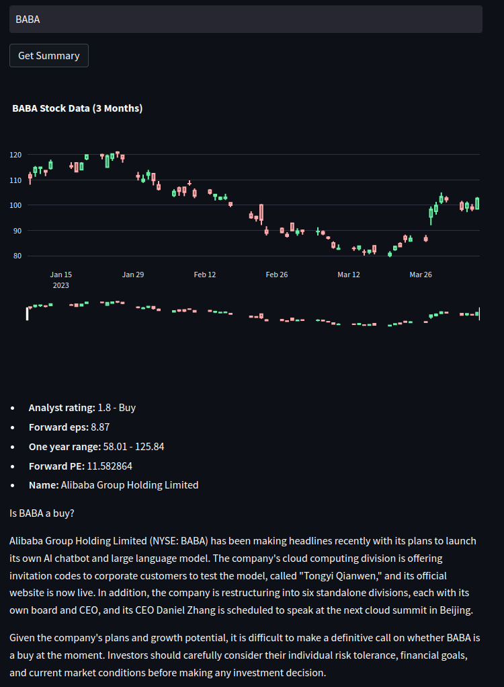

# Stock summary app

Stock summarization app that retrieves financiel data from Yahoo Finance and summarizes recent news using OpenAI language models.

The app runs locally with Streamlit web UI. Disclaimer

Be advised that each query incurs an OpenAI API fee ranging from $0.02 to $0.15. Your mileage may vary so it's recommended to monitor the expenses.



# Install

- Requires [docker](https://docs.docker.com/get-docker/)
- Tested on Ubuntu
- create an `api-keys.env` file with `OPENAI_API_KEY=abcdxxxxx...xxx` content

```bash
sh build.sh
```

# Run

```bash
sh run.sh
```

Open the [web app](http://0.0.0.0:8501)

App keeps running until it's stopped even after reboot. To stop, use docker kill.

Find out the container id with `docker ps` and stop the container with `docker kill [container_id]`  

# Discalimer

This app is not intended to provide financial advice. It is imperative to conduct your own research and analysis before making any decisions to buy or sell stocks. The app's purpose is solely to offer information and data aggregation and the provided information may contain factual errors.